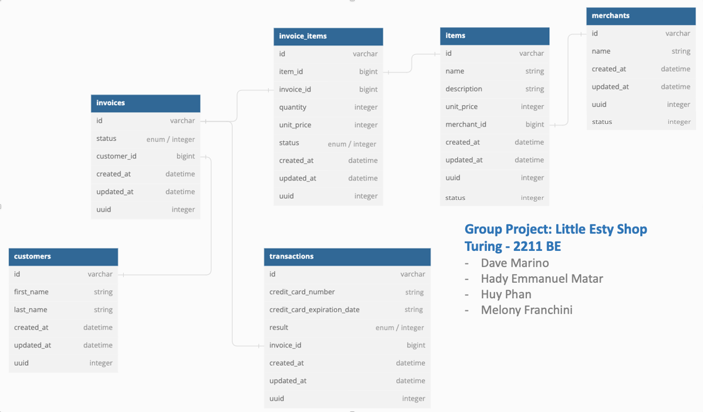

# Little Esty Shop

## Little Esty Shop by Team JazzyCoders

### Name of Contributors & Github Links

[Hady Matar](https://github.com/hadyematar23) 
[David Marino](https://github.com/davejm8) 
[Huy Phan](https://github.com/HuyPhan2025) 
[Melony Franchini](https://github.com/MelTravelz) 

### Descirption of Project
This project, entitled "Little Esty Shop", was a Turing BE-Mod2, Group Project focusing on designing an e-commerce platform. It's funcitonality would allow merchants as well as admins to manage inventory & fill customers orders. 

The project was complete using `Ruby on Rails` and `PostgreSQL` for the database, `Heroku` for app deployment to the web, and `Github Projects` for time and project management. 

New concepts learned during the course of this project included: 
- implementing `rake tasks` in order to seed data from the `CSV` files into the database; 
- working with new gems for additional functionality including `factory_bot_rails`, `faker`, `webmock`, `figaro`, and `faraday` (we attempted to use `vcr` but removed that later when it proved too challenging to implement);
- creating complex `ActiveRecord` queries to the database; 
- hitting an endpoint provided by an external `API` to serve data to our site.

### Summary of all Works Completed
Step 1: DTR (Define the Relationship) 
- We first began the project by completing a DTR to understand how each member prefer to work, their strengths and weaknesses, and any scheduling conflicts that might have come up.

Step 2: GitHub & Setup 
- Then we selected one member to fork and clone the respo so we had our own copy to begin working. They invited the rest of the team as collaborators and created a Github Projects page for time and project management. (That's when we also adopted the very snazzy name of `Team JazzyCoders` as can be seen [here](https://github.com/users/hadyematar23/projects/1).

Step 3: Heroku Setup
- Next, we set up the connection to `Heroku`. Here we encountered a few snags but with the documentation and notes from previous projects we were able to solve those problems.

Step 4: Design the Schema 
- We then moved on to designing the database schema and determining relationships between tables. By using `dbdesigner.net` we were able to better visualize the rows and rows of data we were looking at in the CSV files. 

Step 5: Create Tables & Associations
- Utilizing the Driver/Navigator programming style, we were able to create all tables, set up the associations between models, and write all tests for those associations. We chose to do this together so every member had a complete understanding of the structure as well as to mitigate merge conflicts. 

Step 6: Rake Tasks (upload CSV data as records into new tables)
- Our next task was to set up the rake tasks in order to move the data from the CSV files into the database. This took quite a few hours of tinkering and research but we eventually came up with a solution that worked, which can be seen in `app/lib/tasks/csv_load.rake`. We were specifically asked to make a final rake task that would execute all the others, which you'll notice, looks significantly different from the others. 

Step 7: User Stories 1 - 36
- As can be seen in the columns in our Github Projects, we first broke down each User Story by if it dealt with APIs, required ActiveRecord logic, or might be more quick & easy (or so we hoped!). We assigned ourselves to a few easy stories each and worked to complete those first. In our next iteration we looked to find similarities between the Merchant stories (1-18) and the Admin stories (19-36); based on what previous stories we'd completed each member chose a few additional stories to complete. 
As the project progressed, each member assigned themselves to their next user story as they finished each one. We made sure there was a balance of work and learning, meaning, each member had a chance to work through some challenging ActiveRecord as well as a few more simple stories. 

Step 8: API Stories / User Stories 37 - 40
- Once we reached the final 4 stories we realized there was still a lot of work (and learning) to be done. We decided that working together in the Driver/Navigator style was preferred to begin since everything was new. At this point we realized we'd needed to make new directories (and files) such as `app/facades`, `app/poros`, and `app/services`; add new gems (see previous section for list), and searching on new websites for answers including [Github API](https://docs.github.com/en/rest?apiVersion=2022-11-28) and [Postman](https://web.postman.co/).

Step 9: Refactor
- In the time crunch of the last day, we began cleaning up our code: deleting extra spaces and commented out lines, ensuring consistent naming whenever possible, refactoring some advanced routine, creating a partial, and ensuring all project requirements were reached. We had hoped to add html/css to match the provided wireframes but since it was not a required part of the project, we left this till last and did not have enough time to implement those design elements.

Step 10: Final Heroku Deployment
- Once all tests were passing, we moved back to `Heroku` for a final push to deploy the entire app to the web.

### Ideas for Potential Future Contributors
- A refactor of all tests is necessary since some test data was written out line by line while other tests utilize `factory_bot_rails` and `faker`, plus some routes utilize namespacing and advanced routing while others were handrolled. 
- The Front End team would definately need to work their magic since very little html/css was added to this project. (Thanks for making the world a beautiful place FE!)
- Additional functionality for future iterations could include: 
    - Adding security measures and a login for both merchants and admin users.
    - Adding a link on every page to be able to return to the homepage.
    - When visiting the admin dashboard page, add a button to allow an admin to edit merchant information
    - As a merchant, add the ability to edit/update the pricing of their items.
